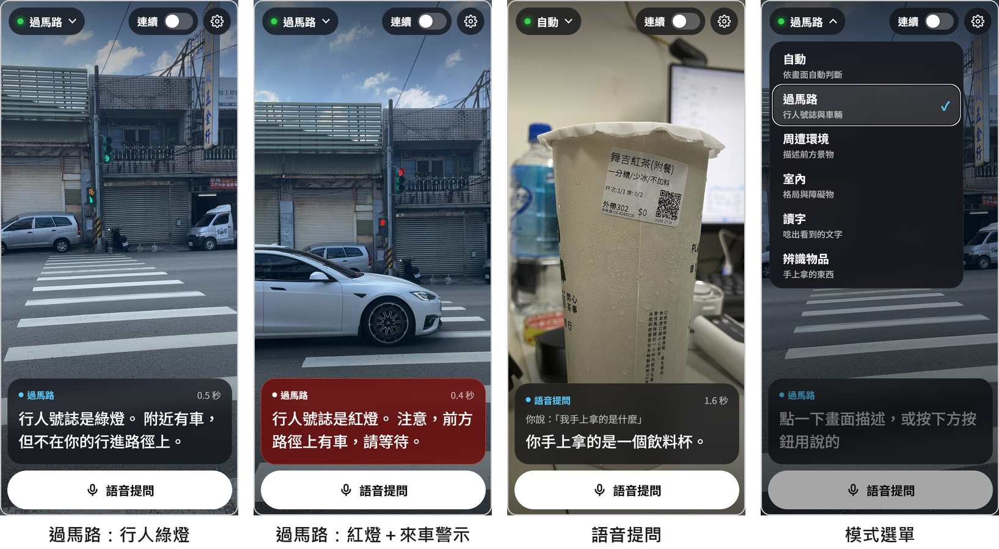
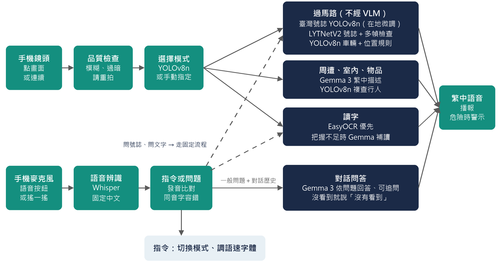
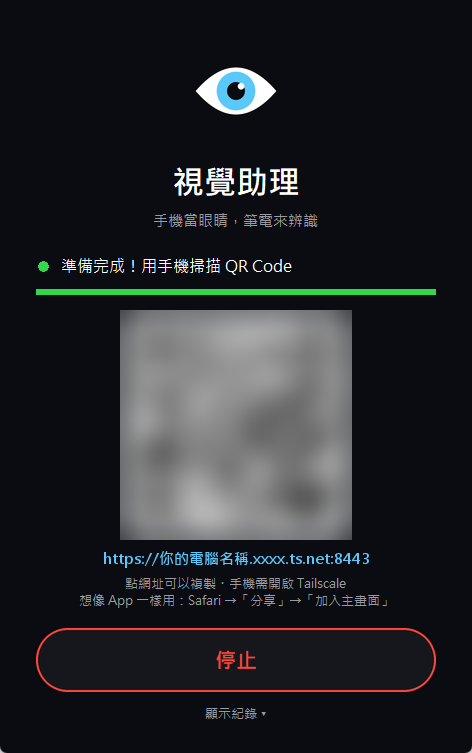

# 明路：視障者的繁中隨身視覺助理

**MingLu: A Traditional-Chinese Visual Assistant for Blind and Low-Vision Users**

手機當眼睛和喇叭，筆電負責辨識。視障者用自己的手機對著前方，點一下螢幕或直接開口問，就能聽到繁體中文的語音回答。
所有 AI 模型都是開源模型，部署在使用者自己的電腦上，影像與聲音不交給第三方雲端處理。



## 功能

- **點畫面描述**：過馬路（行人號誌＋路徑上的車）、周遭環境、室內、讀字、辨識物品、自動選模式
- **語音提問與追問**：按按鈕或搖兩下手機開口問，例如「現在可以過馬路嗎」「我手上拿的是什麼」，可以接著追問
- **語音指令**：切換模式、開關連續描述、調整語速與字體（「說慢一點」「字大一點」）
- **為看不到螢幕的人設計**：點螢幕任何位置即可觸發、危險時紅色警示、斷線時以語音說明
- **一鍵安裝與啟動**：安裝程式自動完成環境設定；啟動器載入完成後顯示 QR Code，手機一掃即可使用

## 系統架構

各模型各司其職：攸關安全的判斷交給專用模型，視覺語言模型只負責開放式描述與問答，模型輸出經規則檢查後才轉成語音。



## 使用的開源模型

| 模型 | 授權 | 在系統中的角色 |
|---|---|---|
| [Gemma 3 4B](https://huggingface.co/google/gemma-3-4b-it)（Google） | [Gemma 使用條款](https://ai.google.dev/gemma/terms) | 周遭、室內、物品的繁中描述；語音問答與追問 |
| [Whisper large-v3-turbo](https://huggingface.co/openai/whisper-large-v3-turbo)（OpenAI） | MIT | 語音辨識 |
| [YOLOv8n](https://github.com/ultralytics/ultralytics)（Ultralytics） | AGPL-3.0 | 偵測車輛、行人與號誌；自動選擇模式 |
| YOLOv8n（本專案以臺灣路口影片微調，`models/pedlight.pt`） | AGPL-3.0 | 辨識臺灣行人號誌的紅燈與綠燈 |
| [LYTNetV2](https://github.com/samuelyu2002/ImVisible)（ImVisible） | MIT | 判斷行人號誌燈號 |
| [EasyOCR](https://github.com/JaidedAI/EasyOCR)（JaidedAI） | Apache-2.0 | 讀取繁體中文與英文文字 |

Gemma 與 Whisper 的模型檔不包含在本倉庫中，安裝時會從 Hugging Face 下載；使用 Gemma 須自行同意其使用條款。

## 安裝與使用

需要 Windows 10／11、NVIDIA 顯示卡（顯示記憶體 8 GB 以上）、Python 3.10～3.12。

1. 下載本倉庫，放在路徑較短的資料夾（例如 `C:\明路`）
2. 雙擊 **`安裝.bat`**，依畫面指示登入 Hugging Face
3. 雙擊桌面的「視覺助理」，按「啟動」，用手機掃描 QR Code



詳細步驟、手機連線方式（含 Tailscale）、語音指令一覽與常見問題，請見 **[README_資服版.md](README_資服版.md)**。

## 專案結構

```
app/                 系統本體（伺服器、各模式流程、語音、號誌偵測）
models/pedlight.pt   臺灣行人號誌偵測模型（本專案微調）
tools/               安裝、打包，以及號誌模型的資料標註與訓練工具
code/                研究用的評估與效能測試程式（見 README_論文評估程式.md）
external/ImVisible/  LYTNetV2 模型（MIT，保留原授權）
launcher.pyw         啟動器
安裝.bat / 啟動.bat / 打包.bat
```

## 致謝

本專案以所屬實驗室先前的研究程式為基礎改寫（原研究的評估程式說明見 [README_論文評估程式.md](README_論文評估程式.md)），
並在此之上完成繁體中文化、語音互動、臺灣行人號誌在地化與部署工具。
行人號誌分類模型 LYTNetV2 來自 [ImVisible](https://github.com/samuelyu2002/ImVisible)（Yu et al., 2019）。

## 授權

本專案以 **[GNU AGPL-3.0](LICENSE)** 授權釋出（因使用 Ultralytics YOLOv8，其授權為 AGPL-3.0）。
`external/ImVisible/` 保留其原本的 MIT 授權；各模型依其各自的授權條款使用。
